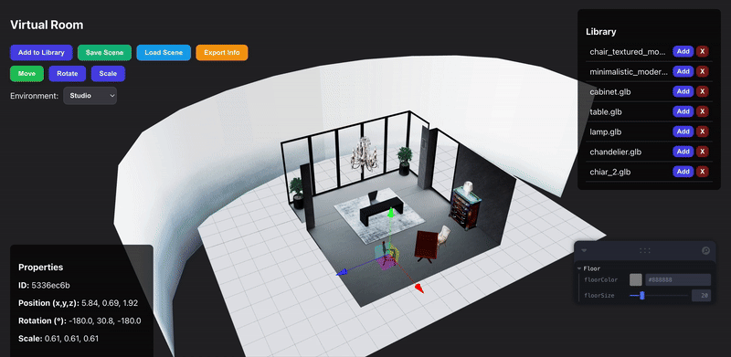

# Mesh Platform - 3D Scene Editor

A web application built with React Three Fiber that allows users to create and manage 3D scenes. Key features include dynamic model loading, interactive object transformation, and flexible scene export options for different use cases.

## Demo



### Interface Overview

**Top Control Panel:**
- **Add to Library** - Upload `.glb` models from your local computer to the reusable library
- **Save Scene** - Export complete scene with both position data AND embedded GLB files in JSON format
- **Load Scene** - Load a previously saved scene JSON file to restore your work
- **Export Info** - Export position/rotation/scale data ONLY in JSON (no GLB files included)

**Transform Controls:**
- **Move** - Change the position (x, y, z) of selected objects
- **Rotate** - Adjust the rotation angles of selected objects  
- **Scale** - Modify the size of selected objects

**Environment Selector:**
- Choose HDRI lighting presets: Studio, City, Dawn, Sunset, or Apartment

**Right Panel - Library:**
- View all uploaded models
- Click **Add** to place duplicate instances of any model into the scene
- Click **X** to remove models from the library

**Left Bottom Panel - Properties:**
- Real-time display of selected object's:
  - ID (unique identifier)
  - Position (x, y, z coordinates)
  - Rotation (in degrees)
  - Scale (size multiplier)
- **Delete Selected Item** button to remove objects from scene

## Features

-   **Model Library:** Upload `.glb` models to a reusable library panel for quick scene building.
-   **Interactive Transformation:** Select objects in the scene to translate, rotate, and scale them with interactive gizmos.
-   **Dual Export System:** 
    - **Save Scene:** Export complete scenes with embedded GLB files for full portability
    - **Export Info:** Export lightweight JSON with only position/rotation/scale data (no model files)
-   **Scene Persistence:** Load previously saved scenes back into the editor with all transformations preserved.
-   **Dynamic Environments:** Change the scene's lighting and reflections by selecting from multiple HDRI environment presets (studio, city, dawn, sunset, apartment).
-   **Properties Inspector:** View detailed data for any selected object and perform actions like deletion.

## Technology Stack

-   React
-   React Three Fiber / Drei
-   Zustand (State Management)
-   Leva (GUI Controls)
-   Three.js

## Local Development

To run this project on your local machine, follow these steps:

1.  **Clone the repository:**
    ```bash
    git clone https://github.com/koliangyu99/mesh_platform.git
    ```

2.  **Navigate to the project directory:**
    ```bash
    cd mesh_platform
    ```

3.  **Install dependencies:**
    ```bash
    npm install
    ```

4.  **Start the development server:**
    ```bash
    npm run dev
    ```
The application will be available at `http://localhost:5173` or another port specified in your terminal.

## How to Use

### Basic Workflow

1. **Add Models to Library**
   - Click "Add to Library" button
   - Select a `.glb` file from your computer
   - The model appears in the Library panel on the right

2. **Build Your Scene**
   - Click "Add" next to any library item to place it in the scene
   - Click on objects in the 3D view to select them
   - Use Move/Rotate/Scale buttons to change transformation mode
   - Drag the gizmo handles to transform objects

3. **Adjust Environment**
   - Use the Environment dropdown to change lighting
   - Choose from: Studio, City, Dawn, Sunset, or Apartment

4. **Export Your Work**
   - **Save Scene** (Green button): Saves everything including GLB files - use this to continue editing later
   - **Export Info** (Orange button): Exports only object data (id, name, position, rotation, scale) - use this for integration with other systems
   - **Load Scene** (Blue button): Reload a previously saved scene

### Export Formats

#### Save Scene Output (`scene.json`)
```json
{
  "library": [
    {
      "name": "chair.glb",
      "url": "data:application/octet-stream;base64,..."
    }
  ],
  "items": [
    {
      "id": "abc123...",
      "name": "chair.glb",
      "url": "data:application/octet-stream;base64,...",
      "position": [0, 1, 0],
      "rotation": [0, 1.57, 0],
      "scale": [1, 1, 1]
    }
  ],
  "environment": "studio"
}
```

#### Export Info Output (`scene_info.json`)
```json
{
  "environment": "studio",
  "items": [
    {
      "id": "abc123...",
      "name": "chair.glb",
      "position": [0, 1, 0],
      "rotation": [0, 1.57, 0],
      "scale": [1, 1, 1]
    }
  ]
}
```

### Lighting System

The platform uses a three-layer lighting setup:

1. **Ambient Light** - Low-intensity (0.1) fill light to soften shadows
2. **Directional Light** - Main light source positioned at `[5, 10, 7]` with 1.8 intensity, creates sharp shadows
3. **HDRI Environment** - Provides realistic reflections and ambient lighting based on selected preset

You can customize the floor color and size using the Leva controls panel (collapsed by default).

## Use Cases

- **Prototyping**: Quickly arrange 3D models to visualize spatial layouts
- **Game Development**: Export scene info JSON to import object positions into game engines
- **Virtual Staging**: Create and save room layouts with furniture
- **3D Presentations**: Prepare scenes and export for use in other applications

## Project Structure

```
mesh_platform/
├── src/
│   ├── App.jsx          # Main application component
│   ├── App.css          # Styling
│   └── main.jsx         # Entry point
├── public/              # Static assets
└── package.json         # Dependencies
```

## Contributing

Contributions are welcome! Please feel free to submit a Pull Request.

## License

[Your License Here]
